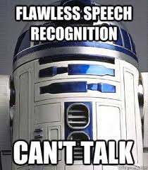

# 2110432 Automatic Speech Recognition course
ASR course at Chulalongkorn University for Spring 2018.

The course will give an overview of the current speech technologies, and discuss about various components of human-machine conversational system. The first part of the course will cover mostly signal processing related topics, such as acoustic theory of human speech production, spectrogram reading, and speech signal representation. The second part of the course will go into Dynamic Time Warping (DTW) and the HMM-based speech recognizer. This includes state-of-the-art techniques such as Finite State Transducers, and deep learning. Other speech processing related topics will also be touched upon, such as speaker/language/emotion recognition, and dialogue systems.

## Course syllabus

## Lectures

[Slides](slides), [YouTube Playlist](https://www.youtube.com/playlist?list=PLcBOyD1N1T-NHospFLG9vGrlz2TXjlRCO)

## Assignments

[HW1 - Testing ASR capabilities and evaluation](HW1)
[HW2 - Signal Analysis](HW2)
[HW3 - Corpus Collection](HW3)
[HW4 - Spectrogram Analysis](HW4)
[HW5 - Feature extraction and DTW](HW5)
[HW6 - Language modeling](HW6)
[Project](project)

## Tutorials (Kaldi-based)

[Tutorials - Kaldi, G2P, and realtime decoding](https://github.com/ekapolc/ASR_classproject)

## Speech corpora
To be added
